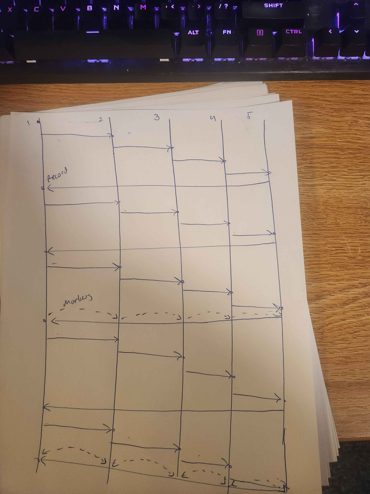

Report for the algorithm:

This one is more complicated compared to project 1. To keep things simple, the processes simply sleep for 2 seconds to ensure all the other processes are started up
by the time the TCP connections are sent out. They do send an additional "verification" message which is for orgnization, as it allows the process to keep the list
of incoming channels in order. From here the, the passToken algorithm starts. This is simple: all it does is check that a received message is the token.
If it is, it records it, prints the necessary data, and sends it to the next process in the ring formation. The interesting part is the Chandi-Lamport snapshot
functionality. The logic here is that when a snapshot order is given via CLI, the process enters a snapshot state, potentially delays, and sends a marker out to
everyone else. Importantly, snapshotting should not interfere with passToken, so in order to not block, the logic is done in a thread to prevent major delays. This
ensures snapshotting does not block passToken. However, it does mean passToken can block snapshot, since the token can be delayed before sending. What this means is that
while a token is being processed, an incoming marker cannot be processed until after the token logic (which includes delay) finishes. To be safe, I discussed this with
Prof.Nita-Rotaru, and she said this was fine. For fun, I did include commented out code that contains a threaded version of token send, which was very interesting, but
gave strange results (as a token could appear in 2 places due to the delays added between recording state and sending the marker). Beyond this, the Chandi-Lamport snapshot
operates as normal. The only other thing was when to start recording. Ther algorithm descriptions typically say to record after marker sending, but
this does not account for delays. Therefore, I also checked via piazza, and gained confirmation that sending before the delay was fine, so I decided on that.
The whole idea of marker delays did throw me for a loop for a good while, but in the end the algorithm works for zero delay, which is the main concern. Otherwise,
the general logic (receive marker, record state, close 1 incoming channel, send markers, record on all other channels) holds true, and of course when a process
receives a marker when it is already snapshotting, it simply closes the channel. The termination condition occurs when the process records all incoming channels
as closed, which causes it to print the completion state message and accept more snapshots.

The interesting case was the extra credit in testcase-5. In order to accomplish this, I extended the functionality of my code to support up to 32 concurrent snapshots.
In order to do this, I made any array that dealt with snapshot status, like closed channel tracking and recording process, include an extra dimension (32 entries long).
With this, whenever a snapshot was received, I could read the snapshot_id, determine if it was bound to a specific spot already, and if not, assign it the next open one,
with slots having values of 0 through 31. What this meant was that any incoming snapshot related message would have its id read, then find the slot it was binded to
(or assign one if needed), and then for any array storing snapshot data, it would access the index matching the binded slot to only see information about that specific snapshot.
This allowed multiple snapshots to occur at once, as their data would now not conflict, meaning they would not mess each other up. This hopefully allows testcase-5 to run as intended,
as now the 2 snapshots will no longer interfere with each other.

Below is a simple state diagram (sort of) to help visualize the process. It mainly illustrates how process 1 starts a snapshot at state = 2, then waits 2 seconds before sending all markers out.
Every process receives, then waits 2 more seconds, before sending all their markers out. This second wave ends the snapshot as all processes receive all other markers.

